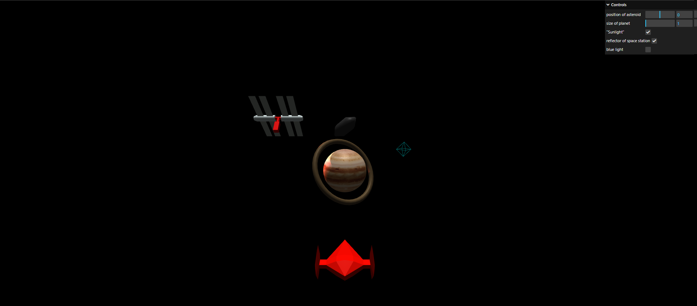

# spaceShipAnimation
It is a mini space game built on Three.js

## Use
1. Download the Three.js (r143 version) from  [threejs.or](https://threejs.org/) or [github](https://github.com/mrdoob/three.js/releases).
2. Put it in the same folder where this project is located and **rename the folder of Three.js** to **three.js**.
3. After it you can run it.
